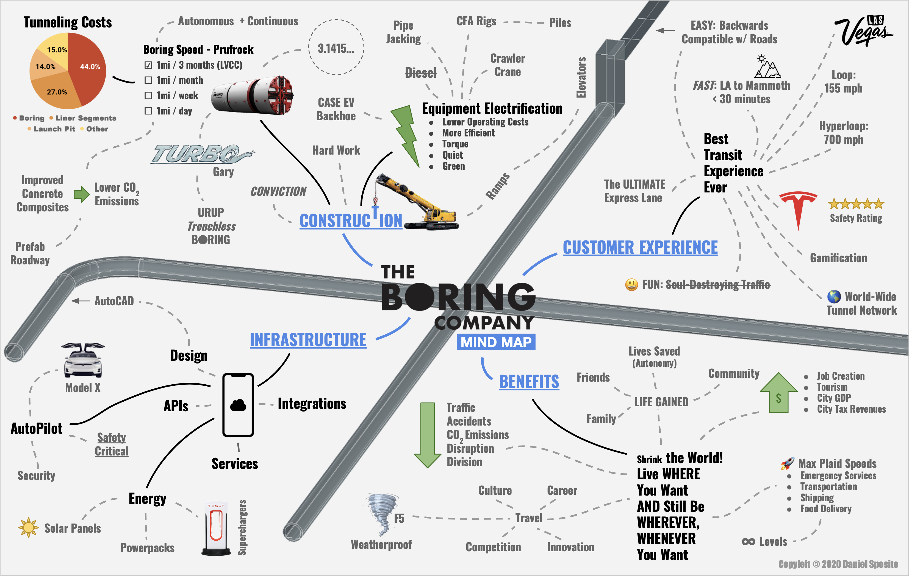

# A Manifesto to Shrink Our World - Tunnels

## Why tunnels?
Our cities are 3D - with buildings that are wide, long and many stories tall. Yet, most of today's modes of transit - including roads and highways - are only 2D; stretching far and wide but rarely more than one level vertically. This makes traffic unavoidable when thousands of people go to and from their 3D home and work places - 2D roads don't have the same physical capacity.

[The Boring Company](https://www.boringcompany.com) is focused on making underground tunnels a cost-effective option:

> To solve the problem of soul-destroying traffic, roads must go 3D - which means either flying cars or tunnels. Unlike flying cars, tunnels are weatherproof, out of sight and won't fall on our heads. A large network of tunnels many levels deep would fix congestion in any city, no matter how large it grew (just keep adding levels). The key to making this work is increasing tunneling speed and dropping costs by a factor of 10 or more – this is the goal of The Boring Company. Fast to dig, low cost tunnels would also make Hyperloop adoption viable in the future and enable rapid transit across densely populated regions, such as from New York to Washington DC in less than 30 minutes.

There are several other benefits to tunnels:

 * Tunnels don't physically divide communities and cities like a major road or highway
 * Construction of tunnels doesn't disrupt cities - meaning no major road closures, reroutes, noise, vibrations, etc. The tunnels are dug more than 30 feet below ground - making them virtually impossible to detect
 * There's no limit to how many tunnels can be added. Whereas, traditional highways can only have so many lanes
 * Tunnels are weatherproof - traveling in them will not be interrupted by rain, hail, snow, ice, fires, or tornadoes

##  Mind Map
*Mind maps are a great way to visualize the relationship of core concepts and ideas to a central theme - like tunnel boring.*

## How will tunnels work with other forms of transportation?
History has taught us that most major improvements to transportation come not from a single leap forward, but instead via continuous and incremental improvements. For example, automobiles haven't been replaced by a radical new type of vehicle. Instead, there has been significant, yet iterative, improvements from internal combustion engines (ICE) to electric motor vehicles (EVs) and autonomous driving. This iterative evolution of automobiles and related global infrastructure is happening over many decades. This makes sense on an economic, technological, cultural and psychological level - it takes a tremendous amount of money, time and effort to invent dramatically better methods and convince society to be comfortable using them.

The hypothesis is that it is critical for these new cost-effective underground tunnels to be backwards compatible with the millions of miles of roadways and automobile infrastructure already in place. Autonomous Electric Vehicles (AEVs) will be able to seamlessly transition to and from a road or highway to an underground tunnel via a ramp or elevator.

## How will tunnels enable dramatically faster transportation?

Imagine the ultimate express lane that's 3-5x faster than typical roadways.

This will be possible for a couple of reasons:

 1. Autonomous Electric Vehicles (AEVs) will be able to travel up to 155mph within the tunnels. Imagine a Tesla Model X - which has room for 7 passengers - driving autonomously via Autopilot through the tunnel
 2. The tunnels will have many on/off ramps (similar to highways) - allowing us to go directly to our destination and further maximizing the vehicle's average speed unlike most buses, subways and trains that travel relatively slowly due to multiple, sequential stops along the way

Videos of The Boring Company's concept and prototypes can be found here:
 * [https://www.youtube.com/watch?v=tfV8z2JY_bI](https://www.youtube.com/watch?v=tfV8z2JY_bI)
 * [https://www.youtube.com/watch?v=VcMedyfcpvQ](https://www.youtube.com/watch?v=VcMedyfcpvQ)

## Still not convinced?
Consider these other net benefits:

 * Accelerates our transition to zero-emission electric vehicles - eliminating millions of tons of CO2 emissions each year
 * Saves thousands of lives due to higher safety and reliability of autonomous transit
 * Reduces the friction of travel - promoting stronger neighborhoods and economic development within communities and connected cities
 * Enables more affordable housing - making it more feasible and desirable to live outside of major cities while being able to easily and quickly commute to/from major hubs
 * Did we mention it's 3-5x faster than traditional driving?
